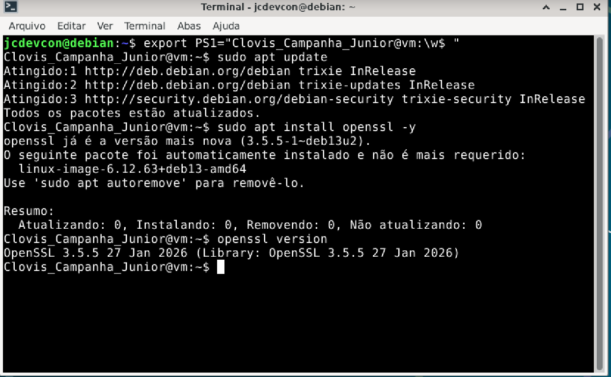

# Exercício 1 – Preparação do Ambiente

## Comandos executados

```bash
# Verificar e instalar atualizações de pacotes 
sudo apt update
sudo apt upgrade

#instalar openssl 
sudo apt install openssl -y

# Verificar versão instalada
openssl version
```

> **Nota:** No Debian o OpenSSL já vem instalado por padrão.

## Print

> 

---

## Explicação dos comandos

**sudo apt update** -> Atualiza a lista de pacotes disponiveis nos repositórios
 - **sudo** -> SuperUser DO - executa comandos com privilégios de administrador(root) sem a necessidade de entrar no sistema como root.
 - **apt** -> gerenciador de pacotes do Debian
 - **update** -> baixa a lista mais recente de softwares

**sudo apt upgrade** -> instala pacotes que estão desatualizados
- **upgrade** -> instala as versões mais recentes 

**sudo apt install openssl -y** -> instala o pacote do openssl
- **install** -> instala um pacote
- **openssl** -> pacote a ser instalado (biblioteca de criptografia)
- **-Y** -> responde "yes" automanticamente para todas as perguntas

**openssl version** -> exibe no terminal a versão do openssl instalado

## O que é o OpenSSL?

O **OpenSSL** é uma biblioteca de código aberto que implementa os protocolos **SSL (Secure Sockets Layer)** e **TLS (Transport Layer Security)**, além de fornecer ferramentas criptográficas de uso geral.

### Principais funcionalidades

- Geração de chaves privadas e públicas (RSA, ECDSA, Ed25519)
- Criação de requisições de certificado (CSR)
- Emissão e assinatura de certificados X.509
- Teste de conexões SSL/TLS
- Operações de hash e cifragem simétrica/assimétrica


