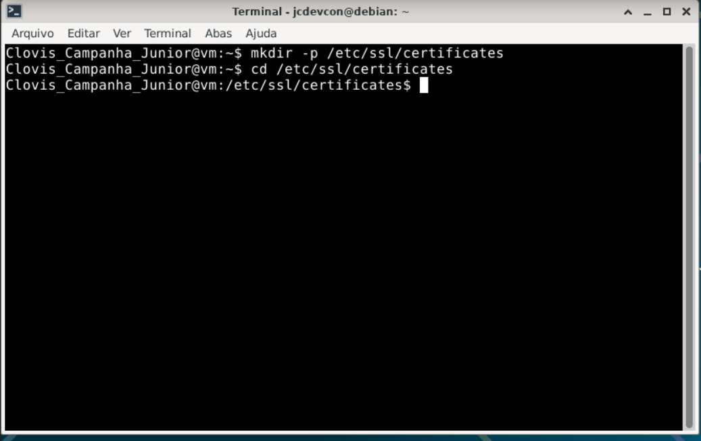

# Exercício 2 – Estrutura de Diretórios

## Comandos executados

```bash
sudo mkdir -p /etc/ssl/certificates
cd /etc/ssl/certificates
```
## Print

> 

---

## Explicação dos Comandos

**sudo mkdir -p /etc/ssl/certificates** -> comando para criar diretórios
- **mkdir** -> cria diretório
- **-p** -> cria diretórios pais se não existirem
- **/etc/ssl/certificates** -> caminho onde o diretório será criado
> **Nota:** certificates é o diretório a ser criado pelo comando mkdir e -p criará etc e ssl caso não existirem

**cd /etc/ssl/certificates** -> muda para o diretório especificado
- **cd** -> change directory (muda o diretório ("entra na pasta"))
- **/etc/ssl/certificates** -> caminho do diretório destino

## Conceitos

O diretório `/etc/ssl/` é o local padrão em sistemas Linux para armazenar certificados e chaves SSL/TLS do sistema operacional e de aplicações.

### Estrutura padrão do `/etc/ssl/`

| Diretório/Arquivo | Finalidade |
| --- | --- |
| `/etc/ssl/certs/` | Certificados de CAs confiáveis do sistema |
| `/etc/ssl/private/` | Chaves privadas (acesso restrito) |
| `/etc/ssl/certificates/` | Diretório criado neste exercício para os arquivos do aluno |


