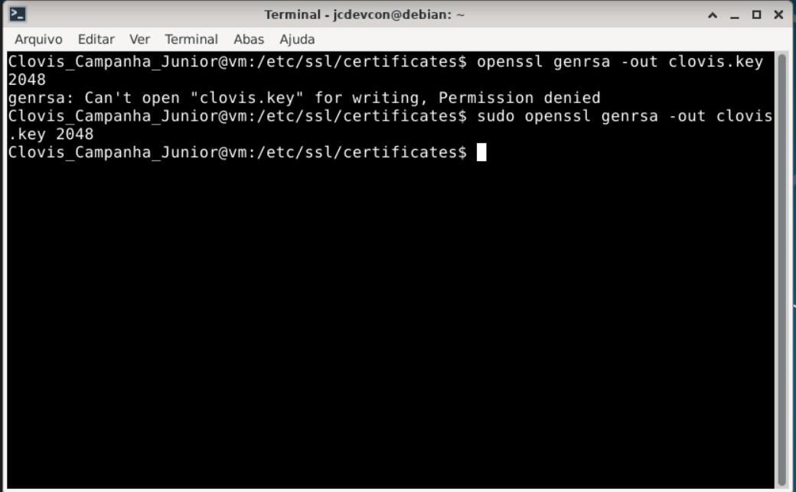
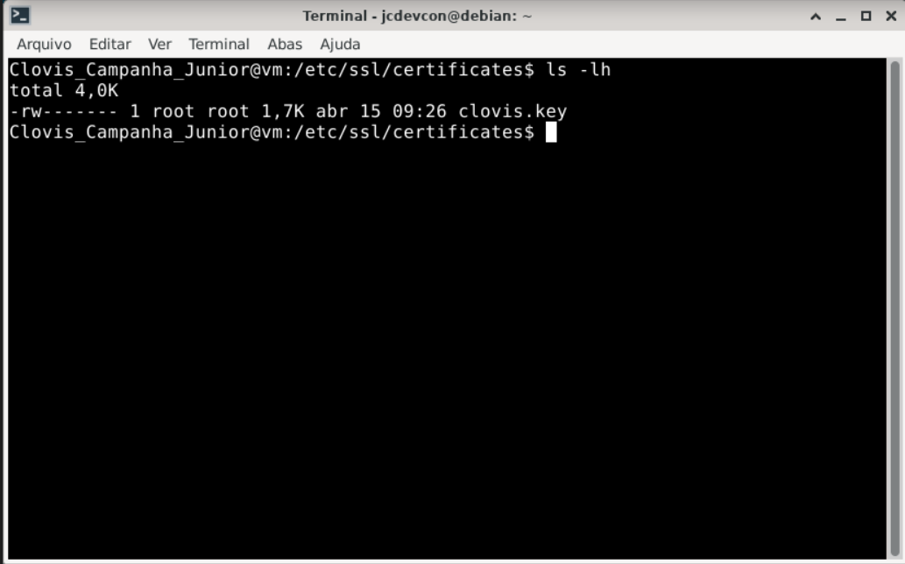
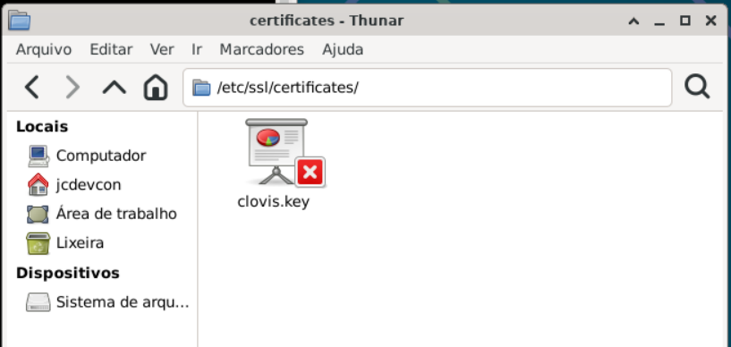

# Exercício 3 – Geração da Chave Privada

## Comandos executados

```bash
sudo openssl genrsa -out clovis.key 2048

ls -lh
```

## Print

> 

> 

> 

---

## Explicação do Comando

**openssl genrsa -out clovis.key 2048** -> gera uma chave privada 
- **genrsa** -> gera chave RSA
- **-out** -> indica a saida do comando
- **clovis.key** -> nome do arquivo de saída
- **2048** -> tamanho da chave em bits 

**ls -lh** -> lista os arquivos de forma detalhada dentro do diretorio
- **ls** -> lista arquivos e diretórios dentro do diretório origem
- **-l** -> long format - mostra os arquivos em formato detalhado contendo permissões, tamanho, owner, group, etc.
- **-h** -> human readable - mostra o tamanho do arquivo em formato legível para humanos.


### O que é uma chave privada RSA?

Uma chave privada RSA é um dos dois elementos principais do algoritmo de criptografia RSA (o outro é a chave pública). Ela é a parte secreta do par de chaves e deve ser mantida protegida.

### Por que 2048 bits?

- É o tamanho mínimo recomendado atualmente para RSA
- Oferece equilíbrio entre segurança e desempenho
- Chaves de 4096 bits são mais seguras, porém mais lentas
- Abaixo de 2048 bits é considerado inseguro pelos padrões atuais (NIST)

### Segurança da chave privada

A chave privada **jamais deve ser compartilhada**. Ela é usada para:

- **Assinar** dados — garantindo autenticidade
- **Descriptografar** dados cifrados com a chave pública
- **Estabelecer** sessões TLS no servidor

O arquivo é armazenado com permissões restritas para protegê-lo de acesso não autorizado.

