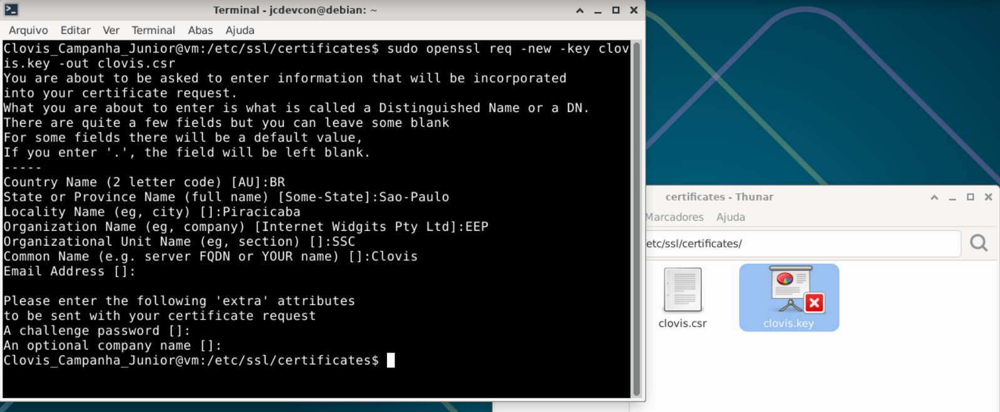

# Exercício 4 – CSR (Certificate Signing Request)

## Comandos executados

```bash
sudo openssl req -new -key clovis.key -out clovis.csr
```

## Print

> 


---

## Explicação do Comando

**openssl req -new -key clovis.key -out clovis.csr** -> cria um arquivo de requisição de certificado
- **req** -> trabalhar com requisições de certificado
- **-new** -> cria uma nova requisição
- **-key** -> usa a chave privada informada (clovis.key)
- **-out** -> indica a saida do comando, neste caso o arquivo clovis.csr 


### O que é um CSR?

O **CSR (Certificate Signing Request)** é uma requisição de assinatura de certificado. 

### Conteudo do CSR

1. **A chave pública** do solicitante (extraída da chave privada `clovis.key`)
2. **Informações de identidade** (país, estado, organização, Common Name)
3. **Uma assinatura digital** gerada com a chave privada, provando que o solicitante possui a chave privada correspondente

>### Nota

Em um ambiente real, o CSR seria enviado a uma **CA (Certificate Authority)** — como Let's Encrypt, DigiCert ou Sectigo — que validaria a identidade do solicitante e emitiria um certificado assinado confiável. 
