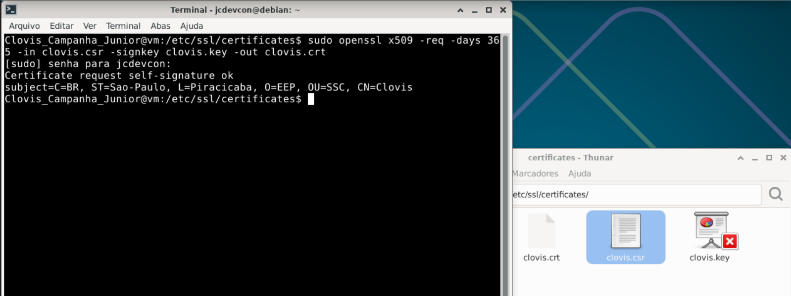

# Exercício 5 – Certificado Auto-assinado (Self-Signed)

## Comandos executados

```bash
sudo openssl x509 -req -days 365 -in clovis.csr -signkey clovis.key -out clovis.crt
```

> 

## Explicação do Comando

**openssl x509 -req -days 365 -in clovis.csr -signkey clovis.key -out clovis.crt** -> gera um certificado autoassinado
- **x509** -> padrão de formato de certificado digital
- **-req** -> indica que a entrada é uma requisição (CSR)
- **-days** -> validade do certificado (365 dias)
- **-in** -> indica o arquivo de entrada (clovis.csr)
- **-signkey** -> indica a chave que será usada para assinar (clovis.key)
- **-out** -> indica a saida do comando (gerando o certificado clovis.crt)

### O que é o padrão X.509?

O **X.509** é o padrão internacional que define como os certificados devem ser estruturados.

É usado em: 
- HTTPS (sites seguros)
- SSL/TLS
- Autenticação
- Assinaturas Digitais

### O que é um certificado X.509?

É um arquivo que contem:
- identidade (quem é o dono)
- chave publica
- assinatura digital de uma autoridade (ou nesse caso a autoassinatura)

### Estrutura de um certificado X.509

| Parametro | Descrição |
| --- | --- |
| Subject (Titular) | Quem é o dono (Nome, Pais, Organização, Dominio) |
| Issuer (Emissor) | Quem emitiu o certificado (CA ou autoassinado) |
| Chave Publica | A chave que será usada para (criptografar dados, verificar assinaturas) |
| Validade | Defini o período (`Not Before` inicio , `Not After` expiração)|
| Numero de Série | Identificador unico do certificado |
| Assinatura Digital | Assinatura feita com a chave privada do emissor (impede alterações no certificado, garante que o certificado é confiavel) |
<br>

> Em certificados self-signed, **Issuer** e **Subject** são idênticos — o certificado foi assinado por si mesmo.

### Funcionalidade na pratica (HTTPS)

Quando acessa um site:
1) O servidor envia um certificado X.5009
2) O navegador Verifica:
   - quem emitiu
   - validade
   - assinatura
3) Se tudo ok -> Conexão segura

### Diferença entre Self-signed e CA-signed

| | Self-Signed | Assinado por CA |
| --- | --- | --- |
| **Custo** | Gratuito | Gratuito (Let's Encrypt) ou pago |
| **Confiança** | Não reconhecido por browsers | Reconhecido automaticamente |
| **Uso** | Desenvolvimento, testes internos | Produção, sites públicos |
| **Validação de identidade** | Nenhuma | Validada pela CA |


