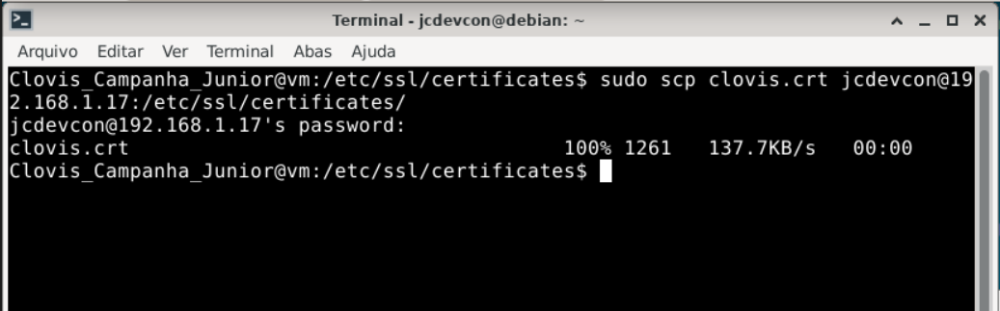

# Exercício 6 – Transferência via SCP

## Comandos executados

```bash
sudo scp clovis.crt jcdevcon@192.168.1.17:/etc/ssl/certificates/
```
> **Nota:** Como o diretorio /etc/ssl/certificates é de propriedade do root é necessário alterar a permissão de escrita e leitura para o usuario comum com o comando 
```bash
sudo chown jcdevcon:jcdevcon /etc/ssl/certificates
```

## Print

> 

---

## Explicação do Comando

**scp clovis.crt jcdevcon@192.168.1.17:/etc/ssl/certificates/** -> copia o arquivo para outro computador
- **scp** -> secure copy (via SSH)
- **clovis.crt** -> arquivo a ser enviado
- **jcdevcon@192.168.1.17** -> destino (usuario + IP)
- **:/etc/ssl/certificates/** -> pasta destino (necessário permissão de escrita e leitura para o usuario comum)

### O que é SCP?

O **SCP (Secure Copy Protocol)** é um protocolo de transferência de arquivos que utiliza o **SSH (Secure Shell)** como canal de transporte, garantindo **criptografia ponta a ponta** durante a transferência.


