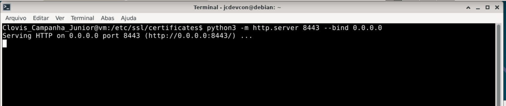
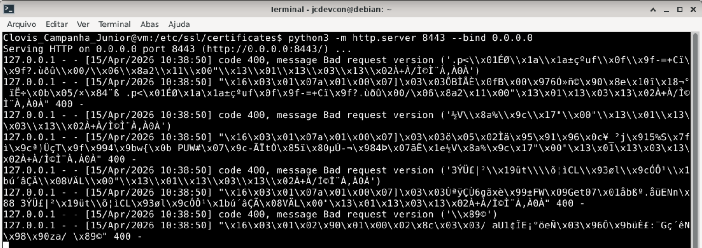
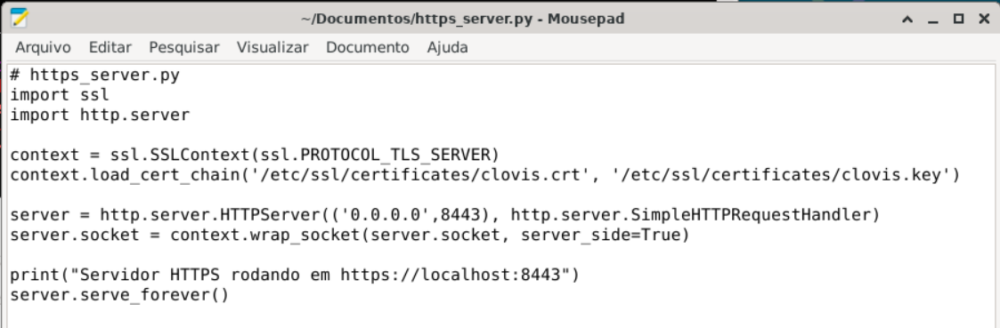
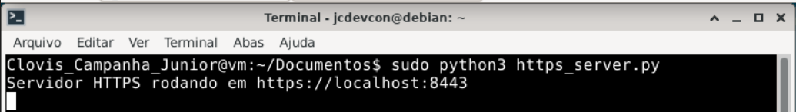
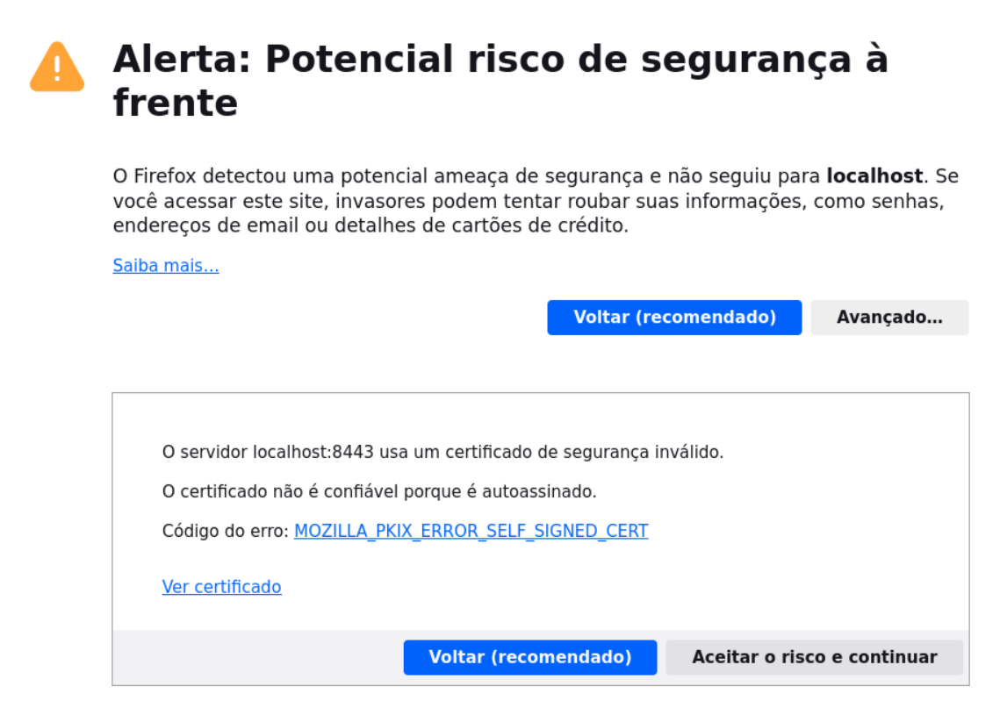
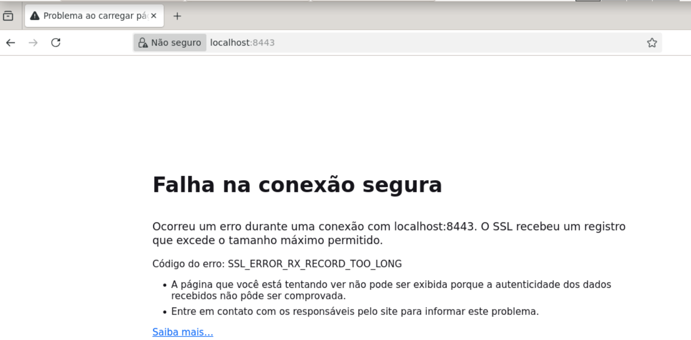

# Exercício 7 – Servidor HTTPS

## Comandos executados

```bash
# comando inicial
python3 -m http.server 8443 --bind 0.0.0.0

# comando corrigido
sudo nano https_server.py
    ```
      import ssl
      import http.server

      context = ssl.SSLContext(ssl.Protocol_TLS_SERVER)
      context.load_cert_chain('/etc/ssl/certificates/clovis.crt', '/etc/ssl/certificates/clovis.key')

      server = http.server.HTTPServer(('0.0.0.0', 8443), http.server.SimpleHTTPRequestHandler)
      server.socket = context.wrap_socket(server.socket, server_side=True)

      print("Servidor HTTPS rodando em https://localhost:8443")
      server.serve_forever()
    ```
sudo python3 https_server.py    
```

## Print
### Comando inicial
> 
> 
### Comando corrigido
> 
> 
> 

---

## Explicação dos Comandos

**python3 -m http.server 8443 --bind 0.0.0.0** -> Cria um servidor HTTP simples
- **python3** -> executa o Python
- **-m http.server** -> usa módulo de servidor web
- **8443** -> porta
- **--bind 0.0.0.0** -> aceita conexões de qualquer IP

**sudo nano http_server.py** -> cria um arquivo de texto que armazenará o script de criaçao do servidor com SSL
- **nano** -> editor de texto nativo no terminal Linux
- **http_server.py** -> nome do arquivo

**sudo python3 https_server.py** -> executa o script em python

## Explicação do Script

```bash
 import ssl  
 # importa a biblioteca python para trabalhar com TLS/SSL (criptografia da conexão) 
 import http.server  
 # modulo que cria servidor HTTP simples 
```
```bash
 context = ssl.SSLContext(ssl.Protocol_TLS_SERVER)
```
| Parametros | Descrição |
| --- | --- |
| context | Variavel ao qual será atribuido um valor ou retorno de uma função |
| SSLContext(...) | Cria um "ambiente/configuração" de segurança SSL/TLS |
| ssl.Protocol_TLS_SERVER | Define que o contexto será usado para um servidor (Habilita versões do TLS automaticamente) |
> **Nota:** Isso faz o servidor aceitar conexões seguras (HTTPS)
```bash
context.load_cert_chain('/etc/ssl/certificates/clovis.crt', '/etc/ssl/certificates/clovis.key')
```
| Parametros | Descrição |
| --- | --- |
| context.load_cert_chain | Associa o certificado e a chave ao servidor |
> **Nota:** Sem isso nao existe HTTPS

```bash
server = http.server.HTTPServer(('0.0.0.0', 8443), http.server.SimpleHTTPRequestHandler)
```
| Parametros | Descrição |
| --- | --- |
| HTTPServer(...) | Cria o servidor web |
| ('0.0.0.0', 8443) | **0.0.0.0** -> aceita conexões de qualquer IP (127.0.0.1 -> só local  192.168.x.x -> só rede interna), **8443** -> porta do servidor (443 -> HTTPS padrão, 8443 -> comumente usada em desenvolvimento e testes para evitar a necessidade de privilégios de root) |
| http.server.SimpleHTTPRequestHandler | Classe que define como responder as requisições (serve arquivos da pasta atual e funciona como um servidor estatico) |

```bash
server.socket = context.wrap_socket(server.socket, server_side=True)
```
| Parametros | Descrição |
| --- | --- |
| wrap_socket(...) | envolve o socket com criptografia TLS |
| server.socket | socket original (HTTP), será transformado em HTTPS |
| server_side=True | Indica que este lado é o servidor e nao o cliente |

> **Nota:** Converte um servidor de HTTP para HTTPS

```bash
print("Servidor HTTPS rodando em https://localhost:8443")
# exibe uma mensagem informativa no terminal
```
```bash
server.serve_forever()
# inicia o servidor e mantem ele rodando continuamente
```

### Acessando `https://localhost:8443` (servidor HTTP)

> 

O navegador exibe o aviso **"Falha na conexão segura"** com o ícone de cadeado descrito como não seguro. Isso ocorre porque o módulo `http.server` do Python **não suporta HTTPS nativamente**. O comando cria um servidor HTTP simples na porta indicada, sem qualquer camada SSL/TLS. Para resolver isso foi criado um script em python para criar um servidor com essa camada e carregar o certificado e a chave privada

### Acessando `https://localhost:8443` (servidor HTTPS)

> 

O navegador exibe o aviso **"Alerta: potencial risco a segurança à frente"** com o ícone de cadeado descrito como não seguro. Isso ocorre porque:
1. O certificado `clovis.crt` é **auto-assinado** (não foi emitido por uma CA reconhecida)
2. O navegador não consegue verificar a **cadeia de confiança** do certificado
3. Sem essa cadeia, não há garantia de que o servidor é quem diz ser

> **Nota:** Em sites reais como `https://google.com` que possuem certificados emitidos por CAs (DigiCert, Let's Encrypt, etc.). Tais CAs estão na **lista de CAs raiz confiáveis** do sistema operacional e dos navegadores. essa lista é mantida e atualizada pelos próprios fabricantes (Mozilla, Google, Microsoft, Apple), sendo assim os certificados são rastreaveis e reconhecidos tornando o site seguro.


