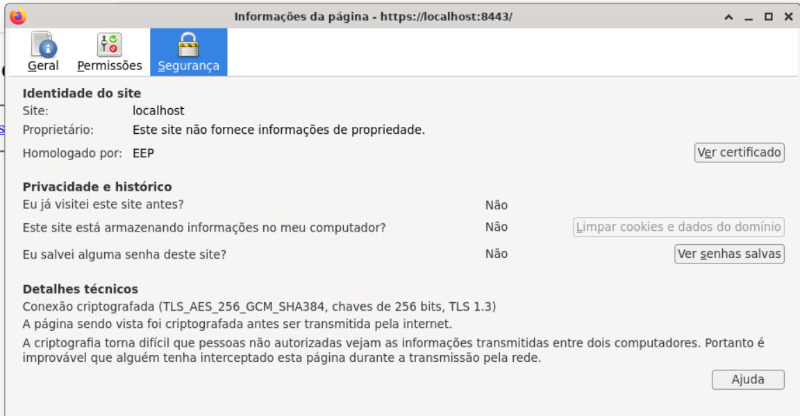
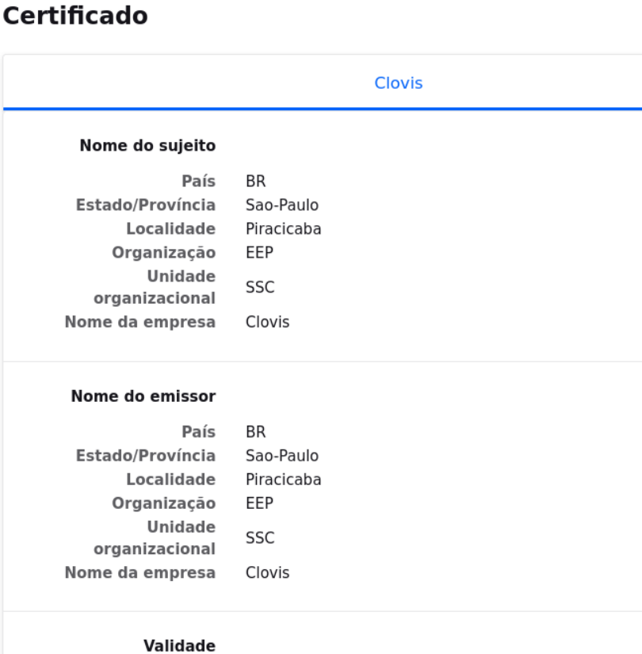
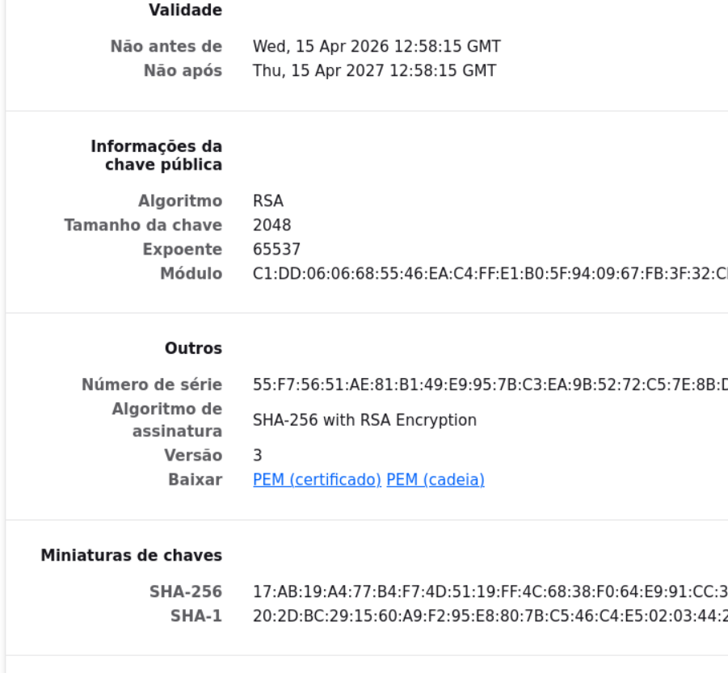

# Exercício 8 – Validação do Certificado

Acesso via navegador: `https://localhost:8443`

## Print

> 
> 
> 

---

## Explicação

### O que o navegador valida em um certificado SSL?

Ao acessar um site HTTPS, o navegador faz uma verificação completa do certificado X.509 antes de permitir a conexão segura. Como o certificado utilizado é autoassinado, ele não é reconhecido por uma autoridade confiável, resultando em um aviso de segurança no navegador. Apesar disso, a conexão ainda utiliza criptografia TLS, garantindo confidencialidade, mas sem validação de autenticidade.

1. O servidor HTTPS envia:
   - certificado (.crt)
   - chave publica
   - informações do X.509

2. O navegador inicia a validação
    - **Assinatura do certificado**
        - quem assinou? (autoassinado)
        - entidade confiavel? (navegador não consegue reconhecer confiabilidade)
    - **Cadeia de confiança (Trust Chain)**
        ```bash
        # Em certificados reais:
        Seu certificado → CA intermediária → CA raiz → navegador confia
        ```
        Neste caso:
          - Não existe cadeia
          - Não há CA reconhecida
        Resultado: erro de segurança
    - **Validade (tempo)**
        - data atual está dentro do período valido?
    - **Nome do certificado (CN ou SAN)**
        - navegador verifica se https://localhost:8443 combina com o certificado
    - **Integridade**
        - Verifica se o certificado foi alterado (usa assinatura digital para isso)
        
### Por que aparece "Não seguro"?

O aviso **"Sua conexão com o site não é segura"** é exibido porque o certificado `clovis.crt` é **autoassinado**: foi assinado pela própria chave privada `clovis.key`, sem participação de uma CA confiável.

O navegador não tem como saber se o emissor é legítimo — qualquer pessoa pode criar um certificado autoassinado para qualquer domínio. Por isso, a validação falha e o aviso é exibido.


